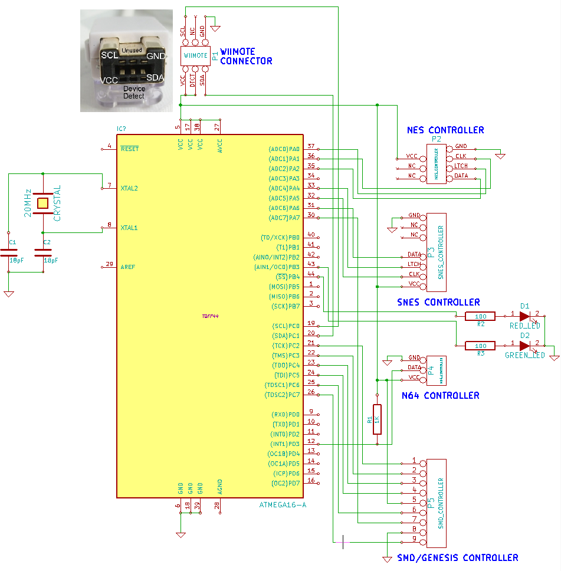

# NES2Wii

NES2Wii - NES/SNES/N64/SMD/DualShock gamepad to Wii remote adapter

Features:

* You can play Wii virtual console games using original NES/SNES/N64/SMD/DualShock gamepad!
* You can connect Wiimote to PC via bluetooth and use original NES/SNES/N64/SMD/DualShock controllers with emulators

## Schematics

Just ATMEGA16 (or any other ATMEGA, just recompile source code). And yes, you need 20MHz crystal for N64 support.

## Fuses
* Low fuse: 0xCF
* High fuse: 0xC9

## How to use with PC
1. Install [GlovePIE](https://sites.google.com/site/carlkenner/glovepie) and [PPJoy](https://www.google.ru/search?q=ppjoy+download)
2. Add virtual joystick using PPJoy
3. Load "classic_controller.pie" script into GlovePIE and start it
4. Connect Wiimote to PC using bluetooth

## Tested on

* ATMEGA16A, 20MHz crystal
* NES, SNES, N64, SMD and DualShock controllers

## Modes
There are three modes for NES/SNES/SMD controllers:
* Mode #1 - D-Pad works as left analog stick and D-Pad on classic controller at the same time
* Mode #2 - D-Pad works as left analog stick only
* Mode #3 - D-Pad works as D-Pad only

You can hold Start+A+B for a few seconds to change mode. Green led will blink 1/2/3 times indicating new mode.

## Known bugs/problems

* You you need to reconnect adapter after channel start or exit to Wii menu. Maybe separate device detect wire will fix this problem? Or I need to reinitialize device somehow? Dunno :(

## Author/contacts

**Alexey 'Cluster' Avdyukhin**

clusterrr@clusterrr.com

[https://github.com/ClusterM](https://github.com/ClusterM "https://github.com/ClusterM")

[http://clusterrr.com](http://clusterrr.com "http://clusterrr.com")
