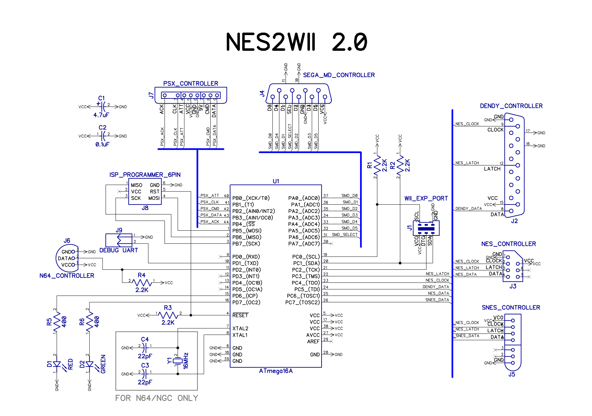

# NES2Wii

NES2Wii - NES/SNES/N64/SMD/DualShock gamepad to Wii remote adapter

Features:

* You can play Wii virtual console games using original NES/SNES/N64/SMD/DualShock gamepad!
* You can use original NES/SNES/N64/SMD/DualShock controllers with NES Mini or SNES Mini
* You can connect Wiimote to PC via bluetooth and use original NES/SNES/N64/SMD/DualShock controllers with emulators

## Schematics

Just ATMEGA16A (or any other low-power ATMEGA). You need 16MHz crystal for N64. 8MHz internal oscillator is fine if you don't need N64.

## Fuses (for ATMEGA16 with crystal)

* Low fuse: 0xFF
* High fuse: 0xD9

## How to use with PC

Just install HID Wiimote driver by Julian Lohr: [http://julianloehr.de/educational-work/hid-wiimote/](http://julianloehr.de/educational-work/hid-wiimote/ "http://julianloehr.de/educational-work/hid-wiimote/")

## Tested on

* ATMEGA16A, 16MHz crystal
* ATMEGA8A, 8MHz (without N64 support)
* NES, SNES, N64, SMD and DualShock controllers

## Modes

There are three modes for NES/SNES/SMD controllers:
* Mode #1 - d-pad works as left analog stick and d-pad on classic controller at the same time
* Mode #2 - d-pad works as left analog stick only
* Mode #3 - d-pad works as d-pad only

You can hold Start+A+B for a few seconds to change mode. Red led will blink 1/2/3 times indicating new mode.

## Notes

* You can select pins and required controllers in *defines.h*.
* *Detect* (*DTCT*) wire is optional but recommended to prevent some glitches. If not used it must be connected directly to VCC.

## Author/contacts

**Alexey 'Cluster' Avdyukhin**

clusterrr@clusterrr.com

[https://github.com/ClusterM](https://github.com/ClusterM "https://github.com/ClusterM")

[http://clusterrr.com](http://clusterrr.com "http://clusterrr.com")
